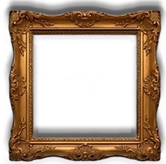
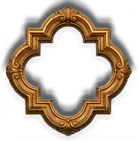
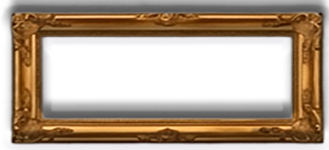
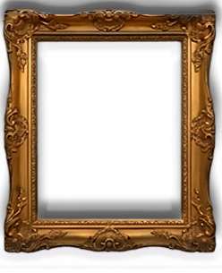
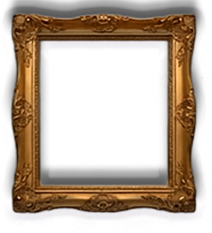
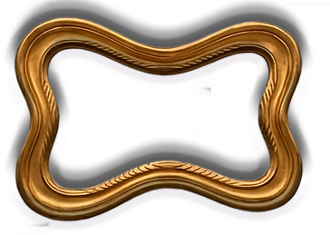

Briefing Técnico — Guidebook Interativo de Hogwarts
Visão Geral do Projeto

Estou desenvolvendo um site temático para um RPG de Hogwarts. O site não segue o padrão de um website moderno responsivo baseado em grids, cards ou layouts fluidos.

A proposta é transformar uma arte criada no Photoshop em uma experiência interativa semelhante a:

um guidebook mágico;
uma visual novel;
um menu de jogo;
um livro interativo de RPG.

O visual é completamente baseado em uma composição artística exportada do Photoshop.

Estrutura Visual

A arte original foi criada em:

2960x1080 px

Todos os elementos foram posicionados manualmente dentro dessa composição.

A estrutura visual é composta pelas seguintes camadas (de baixo para cima):

1. background.png
2. módulos animados / gifs
3. quadros decorativos
4. pergaminho.png
5. logo.png
6. conteúdo do site
Camadas
Background

Arquivo:

src/background.png

Função:

Castelo
Tijolos
Cenário principal

Classe:

.background

Características:

width:100%;
height:100%;
object-fit:cover;

É o elemento visual mais ao fundo.

Gifs / Módulos

Classe:

.gifs

Objetivo:

Adicionar posteriormente:

gifs animados
módulos decorativos
efeitos mágicos

Atualmente ainda não implementados.

Quadros

Arquivos:

src/quadro1.png
src/quadro2.png
src/quadro3.png
src/quadro4.png
src/quadro5.png
src/quadro6.png

Originalmente existia um único:

quadros.png

Porém foi dividido em 6 arquivos independentes para permitir:

hover
animações
interatividade
navegação futura

HTML:

Classe base:

.quadro

Responsável por:

animações
brilho
transições

Exemplo:

.quadro:hover{
    animation:flutuar 2s ease-in-out infinite;

    filter:
        brightness(1.15)
        drop-shadow(0 0 12px rgba(255,215,120,.6));
}

Animação:

@keyframes flutuar

Objetivo:

Criar sensação de quadros mágicos vivos.

Pergaminho

Arquivo:

src/pergaminho.png

Classe:

.pergaminho

Função:

Representa o livro/pergaminho onde o conteúdo será exibido.

Fica acima dos quadros.

Z-index:

z-index:4;
Logo

Arquivo:

src/logo.png

Classe:

.logo

Função:

Elemento decorativo independente.

Importante:

A logo NÃO faz parte do conteúdo.

Ela fica visualmente atrás da área de leitura.

Conteúdo

O conteúdo é a parte mais importante do site.

Representa:

matérias do RPG
eventos
notícias
regras
personagens
textos
imagens
tabelas
qualquer conteúdo publicado

Não faz parte da arte.

É uma camada HTML sobre o pergaminho.

Estrutura Atual do Conteúdo

Existe uma caixa invisível posicionada sobre o pergaminho.

HTML:

    

        conteúdo...

    

scroll-area

Classe:

.scroll-area

Função:

Controlar:

posição
largura
altura

da área de leitura.

Exemplo:

.scroll-area{

    left:54%;
    top:10%;

    width:350px;
    height:480px;
}

É apenas uma janela invisível.

content

Classe:

.content

Função:

Estilizar o conteúdo publicado.

Controla:

fontes
imagens
links
espaçamentos
scroll

Exemplo:

.content{

    width:100%;
    height:100%;

    padding:1px;

    color:#3b2410;

    font-family:Georgia, serif;

    font-size:15px;

    line-height:1.2;
}
Problemas Atuais
Problema 1 — Responsividade

Atualmente:

.quadro1{
    width:200px;
    height:200px;
}

e

.scroll-area{
    width:350px;
    height:480px;
}

usam valores fixos em pixels.

Consequência:

Quando:

resolução muda;
zoom do navegador muda;
monitor muda;

os elementos deixam de acompanhar o pergaminho.

Problema 2 — Sistema Híbrido

Hoje o projeto mistura:

Elementos responsivos:

width:100%;
height:100%;
object-fit:cover;

com elementos fixos:

width:200px;
height:200px;

Isso gera desalinhamentos.

Objetivo Futuro

A intenção é transformar o site em um sistema semelhante a uma visual novel ou interface de jogo.

Os quadros futuramente poderão:

abrir páginas
navegar pelo guidebook
exibir personagens
mostrar gifs
servir como menu
Arquitetura Recomendada para Evolução

Idealmente o projeto deve migrar para uma estrutura baseada em:

Cena Virtual
2960x1080

onde:

todos os elementos possuem coordenadas absolutas baseadas no PSD;
a cena inteira é escalada proporcionalmente;
nenhum elemento interno usa pixels fixos independentes;
quadros, logo, pergaminho e conteúdo permanecem sincronizados.

Esse é o principal desafio técnico atual do projeto.

Tecnologias Utilizadas

Atualmente:

HTML5
CSS3
JavaScript (planejado)

Não há frameworks.

Não há Tailwind.

Não há React.

O projeto é propositalmente simples e baseado em assets PNG exportados do Photoshop.

Objetivo Final

Criar um guidebook mágico altamente imersivo e responsivo para um RPG de Hogwarts, com:

estética de livro mágico;
quadros interativos;
conteúdo rolável dentro do pergaminho;
animações suaves;
sensação de interface de jogo/visual novel;
fidelidade máxima à composição original criada no Photoshop.